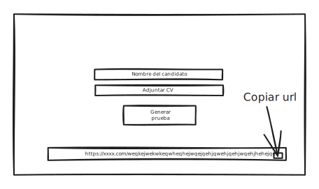

# Goal 
 

# Set up steps
- npx create-next-app@latest
- TypeScript - Yes
- ESLint - Yes
- Tailwind CSS - No
- src/ directory - No
- App Router - Yes
- import alias - No
- npm install --save-dev @commitlint/config-conventional @commitlint/cli
- echo "export default {extends: ['@commitlint/config-conventional']};" > commitlint.config.js
## Types
- build: Changes that affect the build system or external dependencies (example scopes: gulp, broccoli, npm)
- ci: Changes to our CI configuration files and scripts (example scopes: Travis, Circle, BrowserStack, SauceLabs)
- docs: Documentation only changes
- feat: A new feature
- fix: A bug fix
- perf: A code change that improves performance
- refactor: A code change that neither fixes a bug nor adds a feature
- style: Changes that do not affect the meaning of the code (white-space, formatting, missing semi-colons, etc)
- test: Adding missing tests or correcting existing tests

# Getting started
- npm run dev

# Libs
- https://www.conventionalcommits.org/es/v1.0.0/
- https://keepachangelog.com/en/1.0.0/